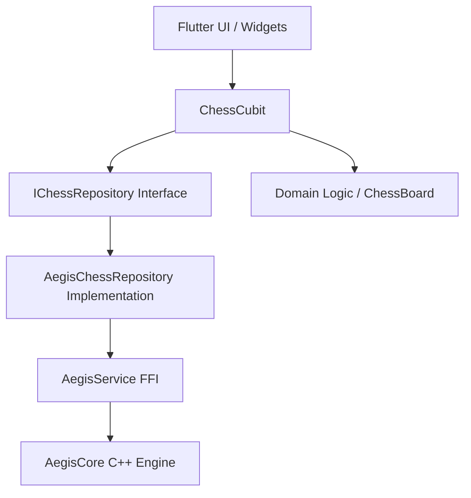

# Flutter Chess: System Architecture & Algorithms

This document provides a deep dive into the technical implementation, architectural patterns, and specialized algorithms powering the Flutter Chess application.

## 1. Architectural Overview

The application follows a strict **Clean Architecture** approach with **Dependency Injection**, ensuring high modularity and testability.

### Layers
- **UI Layer (Widgets)**: Built with Flutter's Material 3 components. Uses **Glassmorphism** (BackdropFilter) and custom animations for a premium feel.
- **State Management (BLoC)**: Handled by `ChessCubit`. It acts as the brain of the UI, managing game rules, timers, and P2P synchronization.
- **Domain Layer (Models)**: Pure Dart logic for Chess rules (`ChessBoard`, `ChessPiece`, `Position`, `CheckDetector`).
- **Data Layer (Repository Pattern)**: Decoupled via `IChessRepository`.
- **Infrastructure Layer**: `AegisService` (native C++ FFI) handles decentralized mesh networking and persistence.

---

## 2. Core Implementation Patterns

### Dependency Injection (DI)
The app uses `RepositoryProvider` at the root (`main.dart`) to inject the `IChessRepository`. This allows the `ChessCubit` to operate independently of the underlying storage/network implementation.
> [!TIP]
> This pattern allows us to swap `AegisChessRepository` with a `FirebaseRepository` or `MockRepository` for testing without touching the UI or Cubit logic.

### Reactive State Management
Every board update, move, or timer tick triggers a new state emission from `ChessCubit`. The UI uses `BlocBuilder` to reactively repaint only the necessary components.

---

## 3. Specialized Algorithms

### A. Resilient Timer (Timestamp Delta Logic)
Unlike standard timers that decrement a counter every second (which drift significantly when the app is backgrounded or throttled), our timer uses **Timestamp Referencing**:
1. When a turn starts, we record `_turnStartTime = DateTime.now()`.
2. Every tick (100ms), we calculate `elapsed = now - _turnStartTime`.
3. `remainingTime = totalTime - elapsed`.
4. On **App Resume**, we immediately force a recalculation. This ensures the timer "catches up" even if the app was suspended for minutes.

### B. Chess Rule Validation (`CheckDetector`)
Validation is performed using a **Simulation-Verification** approach:
- To verify a legal move, the engine temporarily applies the move to a cloned board.
- It then scans all opponent ray-casts; if any intersect the King's coordinate, the move is flagged as illegal.
- **Checkmate Detection**: If the King is in check AND there are zero legal moves available for any piece, checkmate is declared.

### C. P2P Synchronization (Decentralized Mesh)
Sync is handled via **AegisCore's Decentralized Distributed Hash Table (DHT)**:
- Moves are serialized to JSON and stored at a specific match key (`match_$id`).
- All nodes in the mesh eventually reconcile this key via **Gossip Protocols**.
- Connectivity is achieved via WiFi-Direct or Bluetooth Mesh, making it functional in offline environments.

---

## 4. Native Integration (FFI)

The `AegisService` bridges the Dart runtime to the C++ engine using the `dart:ffi` library. It handles:
- **Native Memory Management**: Explicit allocation and deallocation to prevent leaks.
- **Asynchronous Callbacks**: Native events (like "Opponent is Thinking") are bridged into Dart `Streams`.
- **SDK Compatibility**: A native `MethodChannel` detects the Android SDK version to selectively request P2P permissions (`NEARBY_WIFI_DEVICES` for Android 13+ vs `LOCATION` for older versions).

---

## 5. UI/UX Refinements

- **Glassmorphism**: Achieved using `BackdropFilter` with Gaussian blur and semi-transparent overlays.
- **Micro-Animations**:
    - `_RadarAnimation`: Visual feedback during peer discovery.
    - `_ThinkingIndicator`: Real-time active status pulses.
    - Captured pieces count updates with subtle color transitions.

---

## 6. App State Restoration & Persistence

To ensure continuous gameplay across backgrounding, process death, or hardware restarts, we implement a multi-layered restoration strategy:

### A. Local Persistence
Every move and every 5 seconds of time drift is persisted to the local Aegis KV store (`AegisService.put`). This includes:
- **FEN String**: Capture of the exact board layout.
- **Clock States**: `whiteTimeMs` and `blackTimeMs`.
- **Player Metadata**: Custom names and active `matchId`.
- **Wall-Clock Timestamp**: The precise moment of the last save.

### B. The Time-Drift Catch-up Algorithm
When the app resumes or restarts:
1. We load the persisted state.
2. We calculate `drift = currentTime - savedTimestamp`.
3. We identify whose turn it was (`data['turn']`).
4. We subtract the `drift` from that player's remaining time.
This ensures that the "clock is always ticking" even if the app process is completely dead, matching the behavior of professional platforms like Chess.com.

### C. OS-Level Stability
We removed `android:taskAffinity=""` and configured `android:launchMode="singleTop"` in the `AndroidManifest.xml`. This prevents the Android OS from destroying the Activity stack when the user minimizes the app, ensuring the Flutter engine remains hot in memory for as long as possible.
