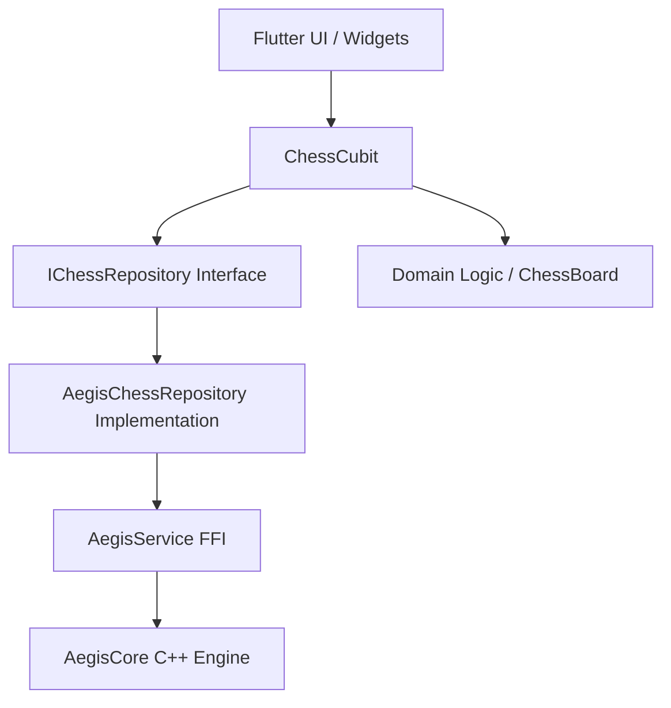

# ♟️ Flutter Chess

<div align="center">

**A modern, production-ready chess application built with Flutter**

[](https://flutter.dev)
[](https://dart.dev)
[](LICENSE)
[](CONTRIBUTING.md)

[Features](#-features) • [Getting Started](#-getting-started) • [Architecture](#-architecture) • [Roadmap](#-roadmap) • [Contributing](#-contributing)

</div>

## 🚀 Features
- **P2P Multiplayer**: Discover and play with nearby friends using **AegisCore** decentralized mesh technology.
- **Resilient Engine**: Robust backgrounding and state restoration; your game continues even if the app is killed.
- **Rules Engine**: Full support for standard moves, check/mate detection, stalemate, and pawn promotion.
- **Board Flip**: Toggle the board view for either player.
- **Game Review**: Step through move history after a game ends.
- **Visuals**: Clean, modern UI with **Glassmorphism** and high-fidelity piece sets.

## 🎯 Vision

Flutter Chess aims to become the **go-to open-source chess platform** for mobile and web, rivaling chess.com and Lichess with:
- **Superior mobile experience** leveraging Flutter's native performance.
- **P2P Offline Capability**: Play anywhere without an internet connection.
- **Community-driven features** and transparent development.
- **Free and open-source**, forever.

---

## ✨ Features

### **Current (v1.1)**

#### 📡 Decentralized P2P
- ✅ **AegisCore Integration**: Peer discovery via WiFi-Direct and Bluetooth.
- ✅ **Decentralized Sync**: Move synchronization across the mesh without a central server.
- ✅ **Real-time Indicators**: Visual cues when the opponent is thinking.

#### ♟️ Core Gameplay
- ✅ **Full chess rules implementation**
  - Standard piece movements (Pawn, Rook, Knight, Bishop, Queen, King)
  - Pawn promotion UI
  - Check and checkmate detection  
  - Stalemate detection
- ✅ **Pure Flutter rendering**
  - Smooth piece animations (300ms `AnimatedPositioned`)
  - Clean, modern UI with captured pieces display and glassmorphism.

#### 🛡️ Resilience
- ✅ **Deep State Restoration**: Game state (FEN, timers, players) persisted automatically.
- ✅ **Wall-Clock Catch-up**: Timers remain accurate even if the app is backgrounded or restarted.

---

## 🚀 Getting Started

### Prerequisites

- **Flutter SDK**: 3.x or higher
- **Dart**: 3.x or higher
- **Android**: SDK 21+ (SDK 33+ recommended for better P2P permissions)
- **iOS**: iOS 13+

### Run the App

```bash
# Clone the repository
git clone https://github.com/decodedfaith/flutter_chess.git
cd flutter_chess

# Install dependencies
flutter pub get

# Run the app
flutter run
```

### Building

```bash
# Android APK
flutter build apk --release

# iOS IPA (requires macOS)
flutter build ipa --release
```

---

## 🏗️ Architecture

The application follows a **Clean Architecture** approach with **BLoC** for state management and a **Repository Pattern** for data/network abstraction.



---

## 🧪 Testing

```bash
# Run all tests
flutter test

# Analyze code quality
flutter analyze
```

---

## 🤝 Contributing

We welcome contributions! Please follow [Effective Dart](https://dart.dev/guides/language/effective-dart) guidelines and ensure all tests pass before submitting a PR.

---

## 📝 License

This project is licensed under the **MIT License**.

---

## 🙏 Acknowledgments

- Chess piece SVGs from [Wikimedia Commons](https://commons.wikimedia.org/)
- Inspired by [Chess.com](https://chess.com) and [Lichess.org](https://lichess.org)
- Built with ❤️ using [Flutter](https://flutter.dev)

_Documentation last updated: 2026-01-16_
